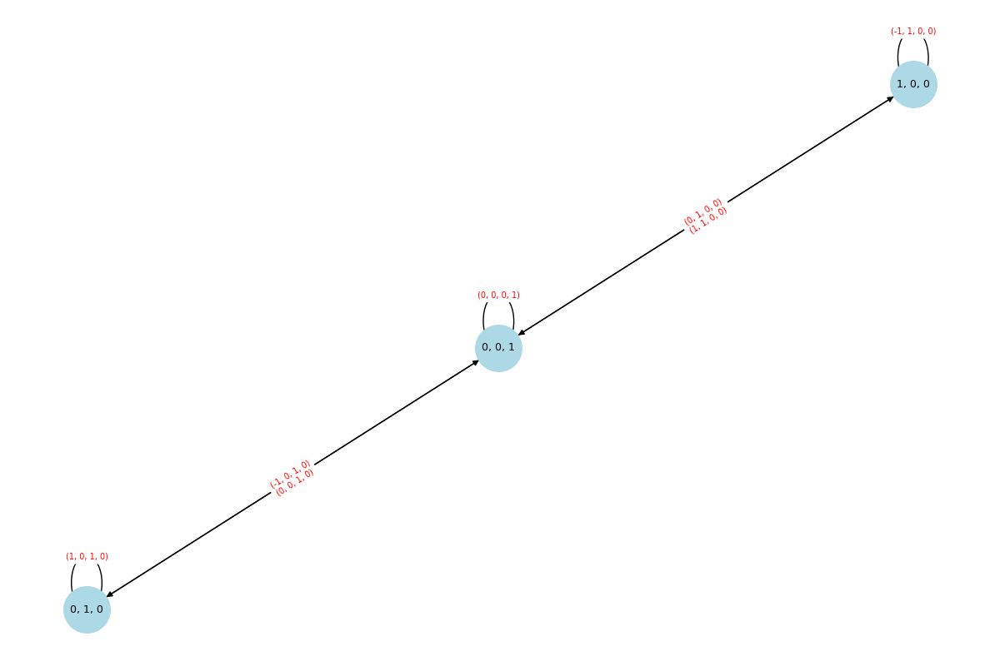
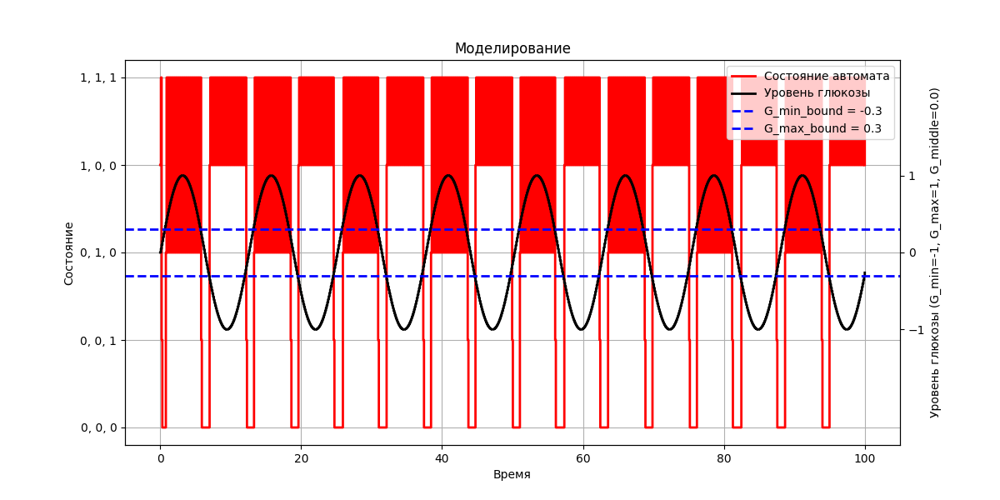

### Отчет по моделированию регуляции уровня глюкозы 

### **0. Постановка задачи**
Целью работы являлось создание модели взаимодействия клеток поджелудочной железы (альфа-, бета- и дельта-клеток) для поддержания гомеостаза глюкозы в крови. Модель реализована на основе автомата Мура, где:
- **Альфа-клетки** секретируют глюкагон (повышают уровень глюкозы),
- **Бета-клетки** секретируют инсулин (снижают уровень глюкозы),
- **Дельта-клетки** секретируют соматостатин (ингибируют альфа- и бета-клетки).

**Шкала уровня глюкозы:**
- **0 (LOW)** — низкий уровень,
- **1 (NORMAL)** — нормальный уровень,
- **2 (HIGH)** — высокий уровень.

Задачи:
1. Реализовать функцию перехода между состояниями клеток в зависимости от уровня глюкозы (0–2).
2. Смоделировать суточные колебания глюкозы с учётом трёх приёмов пищи, используя относительные значения (0, 1, 2). 
- Также следующие округления:
    - 0 <= G < 0.8 -> 0
    - 0.8 <= G < 1.2 -> 1
    - 1.2 <= G < 2 -> 2
3. Визуализировать результаты, включая уровни глюкозы и состояния клеток.
---

### **1. Конфликты в модели**

#### **1. Невозможность одновременной работы альфа- и бета-клеток**:
Согласно правилам, альфа- и бета-клетки не могут быть активны одновременно, так как их активация зависит от уровня глюкозы G > 1.2 и G < 0.8. Это делает дельта-клетки бесполезными, так как условие alpha == 1 and beta == 1 никогда не выполняется.

#### **2. Некорректная работа дельта-клеток**:
Если дельта-клетки активируются (например, из-за временного конфликта), они подавляют альфа- и бета-клетки. Но после этого система может "застрять" в состоянии (0, 0, 1), даже если уровень глюкозы изменится.

---

### **2. Решение конфликтов**
#### **1. Введение буфферной заны**:  
   - Переход между состояниями происходит только при **выходе за пределы зоны гомеостаза**:  
     - Из **NORMAL (1)** в **HIGH (2)** — только при явном повышении уровня глюкозы.  
     - Из **NORMAL (1)** в **LOW (0)** — только при явном снижении.  
   - Это исключает колебания на границах 0–1 и 1–2.
   - буфферная зона: 0.8 <= G < 1.2

#### **2. Задержка деактивации**:  
   - Клетки остаются активными на **1 шаг** после выхода уровня глюкозы из их зоны активации, имитируя инерцию биологических процессов.

---
### **3. Результаты**
0. **Граф состояний**:

1. **Реакция на приёмы пищи**:  
   - После каждого приёма пищи уровень глюкозы повышается до **HIGH (2)**, активируя бета-клетки.  
   - Через 2–3 часа уровень возвращается в **NORMAL (1)**.  
   - Ночью глюкоза опускается до **LOW (0)**, активируя альфа-клетки.

2. **Визуализация**:  
    Смоделировал 3 пика глюкозы (завтрак, обед и ужин) в течени 24 часов.
   - На графике отображаются:  
     - Левая ось Y: состояния клеток (например, "A" — альфа, "B" — бета, "D" — дельта),  
     - Правая ось Y: уровень глюкозы (0, 1, 2).  
     
     

